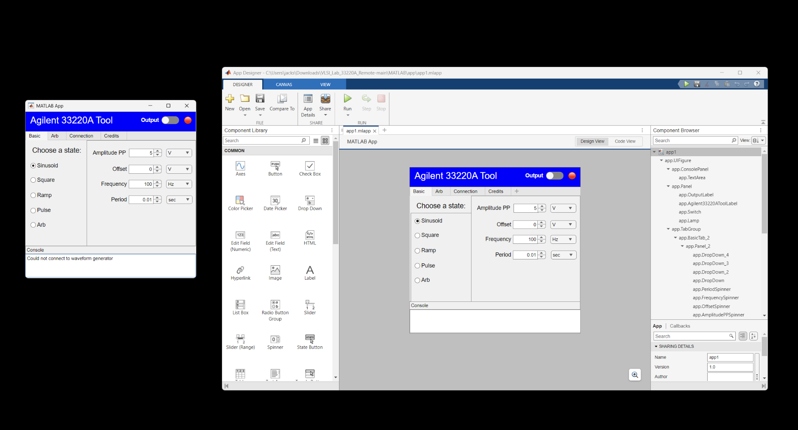
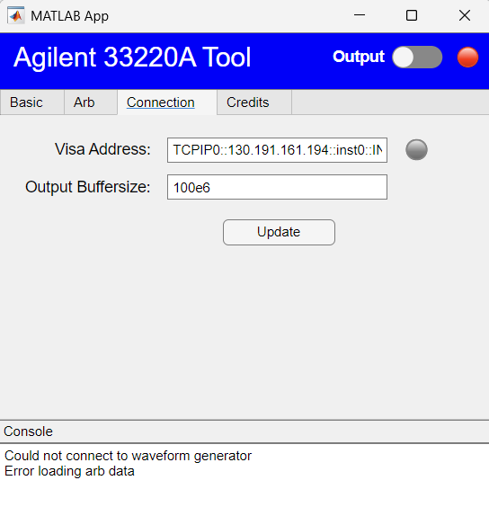
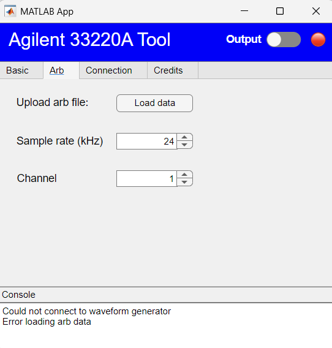
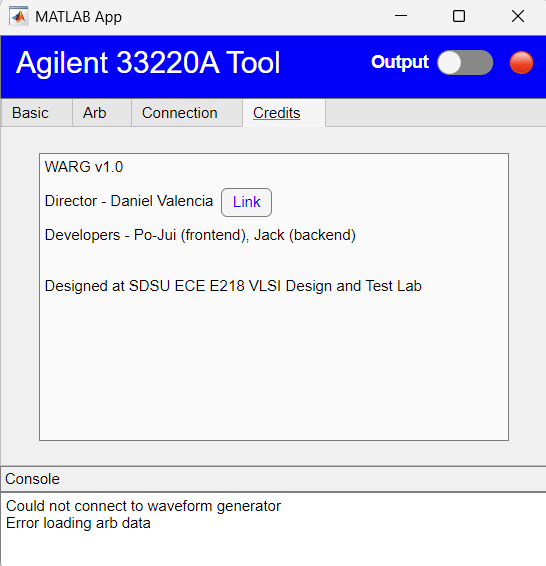

# WaveformGen Agilent Remote GUI (WARG)
A MATLAB Graphical User Interface Program to control the Agilent 33220A Function Generator

This program/app enables users to generate various waveforms using a function generator. We have integrated the built-in waveforms of a function generator into the user interface, offering sine waves, square waves, and ramp waves. Additionally, users can adjust waveform characteristics like duty cycle and symmetry through the custom interface we've developed.

You'll find examples and explanations for how each function is put into action within the MATLAB files. We've also included sample code that demonstrates how to run these functions in your command line in MATLAB

Some files can be ignored, such as those test files. 

The 'memoryslot' file represents a testing version of utilizing the non-volatile memory feature in the function generator. However, it currently does not perform as intended. The 'outputArb' function offers better performance in this regard. The main issue with the 'memoryslot' function is its processing time. The process of uploading and copying data before waveform generation is time-intensive, leading to a longer gap between waveforms compared to the 'outputArb' function.

We planned to use the memory to buy some time for uploading and outputing but it did not work.

# Photos

